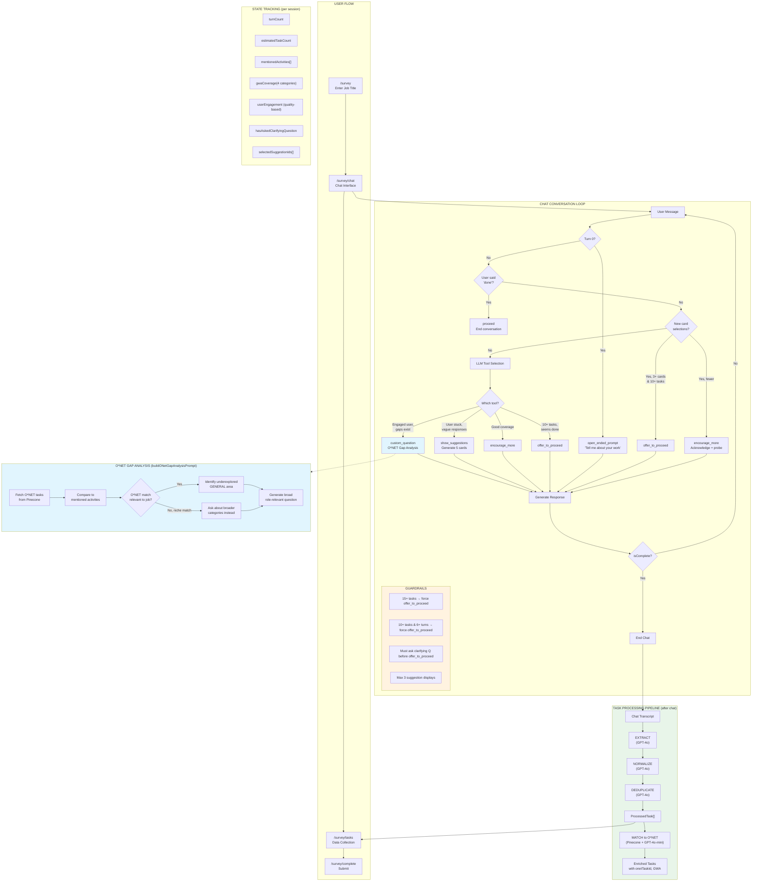
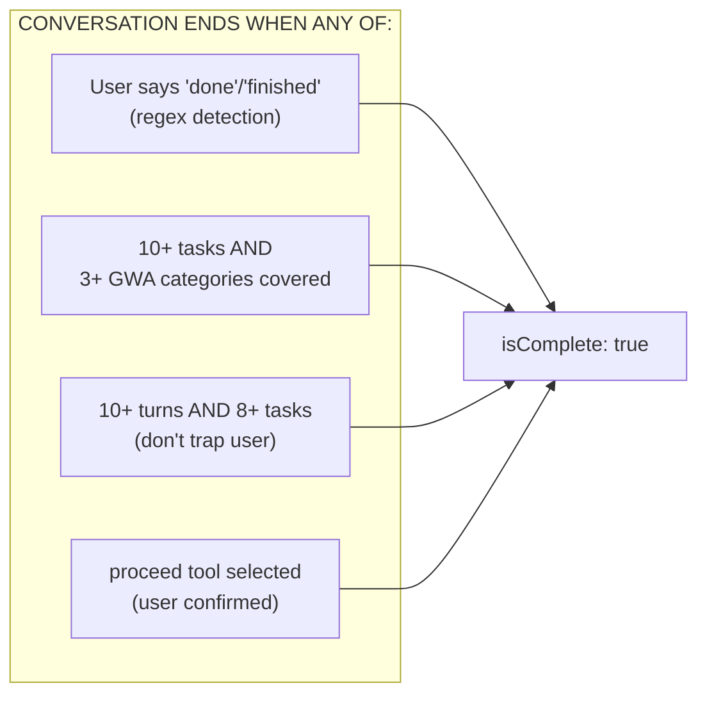
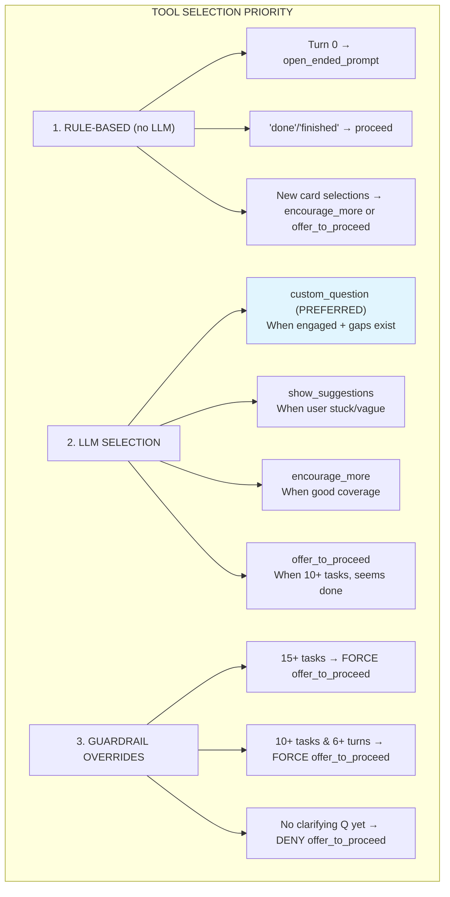

# Chat System Architecture

This document describes the conversational task elicitation system that powers the chat interface in Futura Survey.

---

## System Overview Diagram



### Exit Conditions (Chat Ends When)



### Tool Selection Priority



---

## Executive Summary (for Product Managers)

### What This System Does

The chat system collects work tasks from users through a guided conversation, then processes those tasks to match them against O*NET (the US government's occupational database). The goal is to capture a **complete picture** of someone's job, covering:

- **Information Input** — researching, reading, monitoring
- **Mental Processes** — analyzing, deciding, planning
- **Work Output** — creating documents, code, reports
- **Interacting with Others** — meetings, coordination, presentations

### How It Works (Simple Version)

```
User enters job title → Chat conversation → Tasks extracted → Tasks normalized → Tasks matched to O*NET
```

1. **User describes their work** through chat (or voice transcription)
2. **AI agent decides** what to ask next using O*NET gap analysis for role-specific questions
3. **System identifies gaps** by comparing what user said to typical O*NET tasks for their job
4. **Suggestions shown** if user seems stuck (vague responses, not just short answers)
5. **Conversation ends** when 10+ tasks captured with good coverage
6. **Tasks processed** through a pipeline: Extract → Normalize → Deduplicate → Match to O*NET

### Key Behaviors

| Situation | System Response |
|-----------|-----------------|
| User gives clear answers | Asks O*NET-informed follow-up about gaps for this specific role |
| User seems stuck (vague responses) | Shows suggestion cards to tap |
| Gap in typical tasks for role | Uses O*NET gap analysis to ask about missing area |
| User says "done" | Respects their intent and ends |
| 10+ tasks with good coverage | Offers to proceed |

### Guardrails (Quality Controls)

- Must ask at least ONE clarifying question before offering to proceed
- Minimum 10 tasks before offering to proceed
- Maximum 3 suggestion card displays per conversation
- Never repeat a question already asked

---

## Quick Reference for Prompt Engineers

### Where to Find & Edit Prompts

| Prompt Purpose | File | Function |
|----------------|------|----------|
| **System personality** | `src/lib/chat/agent/prompts.ts` | `AGENT_SYSTEM_PROMPT` (line 7) |
| **Opening question** | `src/lib/chat/agent/prompts.ts` | `buildOpeningPrompt()` |
| **Tool selection** | `src/lib/chat/agent/prompts.ts` | `buildToolSelectionPrompt()` |
| **O*NET gap analysis** ⭐ | `src/lib/chat/agent/prompts.ts` | `buildONetGapAnalysisPrompt()` |
| **Follow-up questions** | `src/lib/chat/agent/prompts.ts` | `buildCustomQuestionPrompt()` |
| **Encourage more** | `src/lib/chat/agent/prompts.ts` | `buildEncourageMorePrompt()` |
| **Suggestion intro** | `src/lib/chat/agent/prompts.ts` | `buildShowSuggestionsPrompt()` |
| **Offer to proceed** | `src/lib/chat/agent/prompts.ts` | `buildOfferToProceedPrompt()` |
| **Initial dump response** | `src/lib/chat/agent/prompts.ts` | `buildInitialDumpResponsePrompt()` |
| **Suggestion generation** | `src/lib/chat/agent/prompts.ts` | `buildSuggestionGenerationPrompt()` |
| **Task extraction** | `src/lib/tasks/extraction-service.ts` | `buildExtractionPrompt()` |
| **Task normalization** | `src/lib/tasks/normalization-service.ts` | `buildNormalizationPrompt()` |
| **Task deduplication** | `src/lib/tasks/deduplication-service.ts` | `buildDeduplicationPrompt()` |
| **O*NET match selection** | `src/lib/onet/matching-service.ts` | `selectBestMatch()` |

### Key Variables to Tweak

| Variable | Location | Current Value | Effect |
|----------|----------|---------------|--------|
| Min tasks to proceed | `agent-service.ts` | 10 | Higher = longer conversations |
| Min turns to proceed | `agent-service.ts` | 4 | Higher = more back-and-forth |
| Max suggestion displays | `agent-service.ts` | 3 | Higher = more suggestion fatigue |
| Engagement detection | `state-service.ts` | Quality-based | Clear answers = engaged, vague = low |
| O*NET tasks for gap analysis | `agent-service.ts` | Top 15 by importance | More = broader gap detection |

### Gap Detection (O*NET-Driven)

The system now uses **dynamic O*NET gap analysis** instead of fixed gap areas:

1. **Fetch O*NET tasks** — Gets top 15 typical tasks for this specific job role
2. **Compare to conversation** — LLM identifies what's been mentioned vs. what's typical
3. **Generate targeted question** — Asks about specific gaps for this role

This approach is:
- **Role-specific** — A Product Manager gets different questions than a Nurse
- **Non-repetitive** — Always looks for NEW gaps, not re-probing fixed categories
- **Data-driven** — Grounded in validated O*NET task database

**Fallback:** For initial dumps, the system still uses general gap areas:
```typescript
const potentialGapAreas = [
  "occasional or periodic tasks (monthly reports, quarterly reviews, annual planning)",
  "problem-solving or troubleshooting activities",
  "administrative tasks (scheduling, expense reports, documentation)",
  "learning or staying current in your field",
];
```

### LLM Configuration

| Call | Model | Temperature | Purpose |
|------|-------|-------------|---------|
| Message Analysis | gpt-4o | 0.3 | Extract tasks, detect engagement (quality-based) |
| Tool Selection | gpt-4o | 0.3 | Decide what to ask next |
| **O*NET Gap Analysis** ⭐ | gpt-4o | 0.3 | Identify gaps vs. typical tasks for this role |
| Response Generation | gpt-4o | 0.7 | Generate natural responses |
| Suggestion Generation | gpt-4o | 0.3 | Create task suggestions |
| Task Extraction | gpt-4o | 0.3 | Pull tasks from transcript |
| Task Normalization | gpt-4o | 0.3 | Convert to O*NET style |
| Task Deduplication | gpt-4o | 0.3 | Merge similar tasks |
| O*NET Match Selection | gpt-4o-mini | 0.0 | Pick best O*NET match |

**Temperature guide:** 0.0 = deterministic, 0.3 = structured/predictable, 0.7 = conversational variation

**Note:** O*NET Gap Analysis is triggered when `custom_question` tool is selected. It fetches typical O*NET tasks for the job and asks the LLM to identify what's missing.

---

## Table of Contents

1. [Executive Summary](#executive-summary-for-product-managers)
2. [Quick Reference for Prompt Engineers](#quick-reference-for-prompt-engineers)
3. [High-Level Architecture](#high-level-architecture)
4. [Message Processing Flow](#message-processing-flow)
5. [Available Tools](#available-tools)
6. [Tool Selection Decision Tree](#tool-selection-decision-tree)
7. [GWA Categories](#gwa-categories)
8. [Card Selection Acknowledgment Flow](#card-selection-acknowledgment-flow)
9. [Agent State](#agent-state)
10. [Exit Conditions](#exit-conditions)
11. [Suggestion Generation](#suggestion-generation)
12. [Response Generation Prompts](#response-generation-prompts)
13. [Part 2: Task Processing Pipeline](#part-2-task-processing-pipeline)
14. [Part 3: LLM Processing — Complete Prompt Reference](#part-3-llm-processing--complete-prompt-reference)
15. [Part 4: Product Logic Deep Dive](#part-4-product-logic-deep-dive)
16. [Part 5: Data Types Reference](#part-5-data-types-reference)
17. [Part 6: Chat Scenarios & User Flows](#part-6-chat-scenarios--user-flows)
18. [Part 7: Client-Side De-duplication](#part-7-client-side-de-duplication)
19. [Key Design Decisions](#key-design-decisions)

---

## High-Level Architecture

```
┌─────────────────────────────────────────────────────────────────────────────┐
│                              USER MESSAGE                                    │
│                        "I do data analysis with SQL"                        │
└─────────────────────────────────────────────────────────────────────────────┘
                                      │
                                      ▼
┌─────────────────────────────────────────────────────────────────────────────┐
│                           CHAT SERVICE                                       │
│                         "The Orchestrator"                                   │
│                     src/lib/chat/chat-service.ts                            │
│                                                                              │
│   Coordinates all components. Handles session management and message flow.   │
└─────────────────────────────────────────────────────────────────────────────┘
                                      │
          ┌───────────────────────────┼───────────────────────────┐
          ▼                           ▼                           ▼
┌─────────────────────┐   ┌─────────────────────┐   ┌─────────────────────┐
│   STATE SERVICE     │   │   AGENT SERVICE     │   │   TOOLS SERVICE     │
│   "The Memory"      │   │   "The Brain"       │   │   "The Hands"       │
│                     │   │                     │   │                     │
│ • Track GWA coverage│   │ • Select next tool  │   │ • Execute actions   │
│ • Count tasks       │   │ • Generate response │   │ • Fetch suggestions │
│ • Detect engagement │   │ • Apply guardrails  │   │ • Set flags         │
│ • Parse activities  │   │                     │   │                     │
└─────────────────────┘   └─────────────────────┘   └─────────────────────┘
                                      │
                                      ▼
┌─────────────────────────────────────────────────────────────────────────────┐
│                           LLM SERVICE                                        │
│                  src/lib/chat/agent/llm-service.ts                          │
│                                                                              │
│   Wrapper for OpenAI calls (JSON generation, streaming, text generation)    │
└─────────────────────────────────────────────────────────────────────────────┘
                                      │
                                      ▼
┌─────────────────────────────────────────────────────────────────────────────┐
│                         ASSISTANT RESPONSE                                   │
│    "Thanks for sharing! I'm curious about how you gather the information    │
│     you need for your analysis. Do you spend time researching or            │
│     reviewing data as part of your role?"                                   │
└─────────────────────────────────────────────────────────────────────────────┘
```

---

## Message Processing Flow

```
┌──────────────────────────────────────────────────────────────────────────────┐
│ STEP 1: REQUEST ARRIVES                                                      │
│ { sessionId, message, jobTitle }                                            │
└──────────────────────────────────────────────────────────────────────────────┘
                                      │
                                      ▼
┌──────────────────────────────────────────────────────────────────────────────┐
│ STEP 2: STATE SERVICE ANALYZES MESSAGE                                       │
│                                                                              │
│ stateService.analyzeAndUpdateState(message, state)                          │
│                                                                              │
│ • Extract new tasks/activities mentioned                                     │
│ • Update GWA category coverage                                               │
│ • Detect user engagement level (high/medium/low)                            │
│ • Check for stop intent ("done", "finished", "that's all")                  │
│                                                                              │
│ Returns: Updated AgentState                                                  │
└──────────────────────────────────────────────────────────────────────────────┘
                                      │
                                      ▼
┌──────────────────────────────────────────────────────────────────────────────┐
│ STEP 3: AGENT SELECTS TOOL                                                   │
│                                                                              │
│ agentService.selectTool(state)                                              │
│                                                                              │
│ LLM decides which tool based on:                                            │
│ • Turn count (what phase of conversation?)                                  │
│ • Estimated task count (enough yet?)                                        │
│ • GWA coverage (any missing categories?)                                    │
│ • User engagement (verbose or terse?)                                       │
│ • Card selections (did they select suggestions?)                            │
│                                                                              │
│ Returns: ToolSelection { tool, params }                                      │
└──────────────────────────────────────────────────────────────────────────────┘
                                      │
                                      ▼
┌──────────────────────────────────────────────────────────────────────────────┐
│ STEP 4: TOOLS SERVICE EXECUTES                                               │
│                                                                              │
│ toolsService.execute(tool, state, params)                                   │
│                                                                              │
│ Most tools are just prompt templates, but some have side effects:           │
│ • show_suggestions → Generates AI suggestions (or fetches O*NET fallback)   │
│ • proceed → Sets shouldProceed flag to end conversation                     │
│                                                                              │
│ Returns: ToolExecutionResult { suggestions?, shouldProceed, context }        │
└──────────────────────────────────────────────────────────────────────────────┘
                                      │
                                      ▼
┌──────────────────────────────────────────────────────────────────────────────┐
│ STEP 5: AGENT GENERATES RESPONSE                                             │
│                                                                              │
│ agentService.generateResponse(tool, state, params)                          │
│                                                                              │
│ • Builds prompt based on selected tool                                       │
│ • Generates natural language response via LLM                               │
│ • Prepends acknowledgment if user selected suggestion cards                  │
│                                                                              │
│ Returns: string (the assistant's message)                                    │
└──────────────────────────────────────────────────────────────────────────────┘
                                      │
                                      ▼
┌──────────────────────────────────────────────────────────────────────────────┐
│ STEP 6: RESPONSE RETURNED                                                    │
│                                                                              │
│ {                                                                            │
│   sessionId,                                                                 │
│   message: { role: "assistant", content: "..." },                           │
│   suggestions: TaskSuggestion[] | undefined,                                │
│   shouldShowSuggestions: boolean,                                           │
│   isComplete: boolean,                                                       │
│   extractedTasks: ExtractedTask[],                                          │
│   toolUsed: AgentTool,                                                       │
│   updatedState: { turnCount, estimatedTaskCount, userEngagement, gwaCoverage }│
│ }                                                                            │
└──────────────────────────────────────────────────────────────────────────────┘
```

---

## Available Tools

The agent has 8 tools at its disposal. Each turn, it selects exactly one.

| Tool | Purpose | Side Effects | When Used |
|------|---------|--------------|-----------|
| `open_ended_prompt` | "Tell me everything about your work" | None | Turn 1 only |
| `follow_up` | "You mentioned X — tell me more" | None | When activity needs expansion |
| `custom_question` ⭐ | O*NET gap-informed question for this role | Runs O*NET gap analysis | **Preferred** when user is engaged |
| `show_suggestions` | Show selectable task cards | Generates AI suggestions | When user seems stuck (vague responses) |
| `encourage_more` | "Anything else?" | None | Default when good progress |
| `offer_to_proceed` | "Looks good — ready to continue?" | None | When 10+ tasks, good coverage |
| `proceed` | End the conversation | Sets shouldProceed=true | When user says "done" |

---

## Tool Selection Decision Tree

```
┌─────────────────────────────────────────────────────────────────────────────┐
│                          TOOL SELECTION FLOW                                 │
└─────────────────────────────────────────────────────────────────────────────┘

Is this turn 1?
     │
     ├── YES ─────────────────────────────────────────→ open_ended_prompt
     │                                                  "Tell me everything"
     │
     NO
     │
     ▼
Did user say "done" / "finished"?
     │
     ├── YES ─────────────────────────────────────────→ proceed
     │                                                  End conversation
     │
     NO
     │
     ▼
Did user select new suggestion cards?
     │
     ├── 3+ cards AND 10+ total tasks ────────────────→ offer_to_proceed
     │                                                  "Looking good! Ready?"
     │
     ├── Any new cards (but <10 tasks) ───────────────→ encourage_more (with gap analysis)
     │                                                  "You've covered X. Do you do tasks related to [gap]?"
     │
     NO
     │
     ▼
┌─────────────────────────────────────────────────────────────────────────────┐
│                    LLM DECIDES (with guardrails)                             │
│                                                                              │
│  Inputs to LLM:                                                              │
│  • Turn count, tasks captured, user engagement                               │
│  • GWA coverage summary (informational, not primary driver)                  │
│  • Recent conversation history (last 6 messages)                            │
│  • List of activities mentioned so far                                       │
└─────────────────────────────────────────────────────────────────────────────┘
     │
     ▼
LLM returns one of:
     │
     ├── custom_question ⭐ ───────────────────────────→ O*NET Gap Analysis triggered!
     │                                                   │
     │                                                   ├── Fetch typical O*NET tasks for job
     │                                                   ├── Compare to what user mentioned
     │                                                   └── Generate role-specific question
     │
     ├── show_suggestions ────────────────────────────→ Show task cards (user seems stuck)
     │
     ├── encourage_more ──────────────────────────────→ Generic "anything else?"
     │
     └── offer_to_proceed ────────────────────────────→ Offer to wrap up
                │
                ▼
┌─────────────────────────────────────────────────────────────────────────────┐
│                         GUARDRAILS APPLIED                                   │
│                                                                              │
│  • offer_to_proceed blocked if:                                             │
│    - No clarifying question asked yet                                        │
│    - Task count < 10                                                         │
│    - Turn count < 4 (unless 10+ tasks AND good coverage)                    │
│                                                                              │
│  • show_suggestions blocked if:                                              │
│    - Already shown 3 times (switch to encourage_more)                       │
│                                                                              │
│  • custom_question: If O*NET gap analysis fails, falls back to LLM question │
└─────────────────────────────────────────────────────────────────────────────┘
```

---

## GWA Categories (Informational)

GWA (Generalized Work Activities) are O*NET's categorization of work. The system tracks coverage for informational purposes, but **O*NET gap analysis is now the primary driver** for question selection.

| Category | Key | Description | Example Keywords |
|----------|-----|-------------|------------------|
| Information Input | `informationInput` | Gathering data, researching, monitoring | read, research, monitor, gather, observe, review data |
| Mental Processes | `mentalProcesses` | Analyzing, deciding, planning | analyze, decide, plan, evaluate, problem-solve |
| Work Output | `workOutput` | Creating deliverables, producing outputs | write, create, build, produce, develop, code |
| Interacting with Others | `interactingWithOthers` | Communicating, coordinating, collaborating | meet, communicate, coordinate, present, collaborate |

**Coverage Levels:** `none` → `low` → `medium` → `high`

**Note:** GWA coverage is still tracked and displayed in prompts, but the preferred approach is now `custom_question` with O*NET gap analysis, which generates role-specific questions based on typical tasks for that job (e.g., "Product Manager" gets different questions than "Nurse").

---

## Card Selection Acknowledgment Flow

When users select suggestion cards, the system acknowledges them without repeating the acknowledgment:

```
┌─────────────────────────────────────────────────────────────────────────────┐
│                   CARD SELECTION ACKNOWLEDGMENT FLOW                         │
└─────────────────────────────────────────────────────────────────────────────┘

STATE TRACKING:
─────────────────────────────────────────────────────────────────────────────
selectedSuggestionIds: string[]       // IDs of all selected cards
previouslyAcknowledgedSelections: number  // Count we've already acknowledged

FLOW:
─────────────────────────────────────────────────────────────────────────────
1. User selects cards (via PATCH /api/chat)
   → selectedSuggestionIds updated in session

2. User sends message
   → agentState syncs selectedSuggestionIds from session

3. hasNewCardSelections check:
   if (selectedSuggestionIds.length > previouslyAcknowledgedSelections)
     → New selections exist, need acknowledgment

4. Response generation prepends acknowledgment:
   "Great, I see you've added 4 tasks from the suggestions! [follow-up question]"

5. After response generated:
   previouslyAcknowledgedSelections = selectedSuggestionIds.length
   → Prevents re-acknowledgment next turn

ACKNOWLEDGMENT MESSAGES:
─────────────────────────────────────────────────────────────────────────────
totalCount >= 3: "Great, I see you've added {n} tasks from the suggestions! "
newCount == 1:   "Got it, I've noted that task! "
newCount > 1:    "Nice, {n} more tasks added! "
```

---

## Agent State

The agent maintains state across the conversation:

```typescript
interface AgentState {
  // Conversation tracking
  turnCount: number;                    // Current turn number
  conversationHistory: Message[];        // Full message history

  // Task tracking
  estimatedTaskCount: number;           // Approximate tasks captured
  mentionedActivities: string[];        // Extracted activities from messages
  underexploredActivities: string[];    // Activities needing more detail

  // GWA coverage
  gwaCoverage: {
    informationInput: "none" | "low" | "medium" | "high";
    mentalProcesses: "none" | "low" | "medium" | "high";
    workOutput: "none" | "low" | "medium" | "high";
    interactingWithOthers: "none" | "low" | "medium" | "high";
  };

  // Engagement tracking
  userEngagement: "high" | "medium" | "low";
  userWantsToStop: boolean;

  // Tool usage tracking
  actionsTaken: AgentTool[];            // History of tools used
  suggestionsShown: number;             // Times show_suggestions was used
  followUpsAsked: number;               // Times follow_up was used

  // Card selection tracking (for UI suggestion cards)
  selectedSuggestionIds: string[];
  previouslyAcknowledgedSelections: number;

  // Duplicate prevention
  shownSuggestionStatements: string[];  // AI suggestions already shown
  pendingSuggestions: string[];         // Text-mentioned tasks pending confirm

  // Guardrail tracking
  hasAskedClarifyingQuestion: boolean;  // Must ask before offer_to_proceed

  // Context
  jobTitle: string;
}
```

---

## Exit Conditions

The conversation ends when ANY of these conditions are met:

```
┌─────────────────────────────────────────────────────────────────────────────┐
│                         EXIT CONDITIONS                                      │
└─────────────────────────────────────────────────────────────────────────────┘

1. USER EXPLICITLY DONE
   │
   ├── User says: "done", "finished", "that's all", "nothing else", etc.
   └── userWantsToStop = true → PROCEED

2. GOOD COVERAGE ACHIEVED
   │
   ├── estimatedTaskCount >= 10
   ├── AND 3+ GWA categories at "medium" or "high"
   └── → isComplete = true

3. MAX TURNS REACHED (safety valve)
   │
   ├── turnCount >= 10
   ├── AND estimatedTaskCount >= 8
   └── → isComplete = true
```

---

## Suggestion Generation

When `show_suggestions` is selected, the system generates contextual task suggestions:

```
┌─────────────────────────────────────────────────────────────────────────────┐
│                    SUGGESTION GENERATION FLOW                                │
└─────────────────────────────────────────────────────────────────────────────┘

1. BUILD PROMPT
   │
   ├── Include: job title, conversation history, GWA coverage gaps
   ├── Include: activities already mentioned (to avoid duplicates)
   └── Include: previously shown suggestions (to avoid repeats)

2. LLM GENERATES SUGGESTIONS
   │
   ├── O*NET-style format: "Verb + object + context/purpose"
   ├── Each suggestion assigned a GWA category
   ├── Target: 5 diverse suggestions
   └── Prioritize: GWA categories with low coverage

3. FALLBACK TO O*NET (if LLM fails)
   │
   ├── Use onetService.getSuggestions()
   └── Filter by lowest GWA category

Example suggestions:
- "Analyze market trends and competitor data to inform product strategy" (mentalProcesses)
- "Coordinate with engineering teams to prioritize feature development" (interactingWithOthers)
- "Review customer feedback and usage metrics to identify improvement opportunities" (informationInput)
```

---

## Response Generation Prompts

Each tool has an associated prompt template:

| Tool | Prompt Builder | Key Instructions |
|------|---------------|------------------|
| `open_ended_prompt` | `buildOpeningPrompt()` | Acknowledge job title, ask about everything, encourage detail |
| `follow_up` | `buildFollowUpPrompt()` | Reference specific activity, ask for more detail |
| `custom_question` ⭐ | `buildONetGapAnalysisPrompt()` | Compare conversation to O*NET tasks, identify gap, ask targeted question |
| `encourage_more` | `buildEncourageMorePrompt()` | Be specific about what they shared, ask for more |
| `show_suggestions` | `buildShowSuggestionsPrompt()` | Brief intro to suggestions |
| `offer_to_proceed` | `buildOfferToProceedPrompt()` | Acknowledge good detail, offer next step option |
| `proceed` | `buildProceedPrompt()` | Thank them, confirm we have enough |

**Special cases:**
- `buildInitialDumpResponsePrompt()` — When user provides tasks upfront on the initial screen.
- `buildONetGapAnalysisPrompt()` — Uses O*NET task data to generate role-specific gap questions.

---

## File Structure

```
src/lib/chat/
├── chat-service.ts          # Orchestrator - ties everything together
├── session-store.ts         # Session persistence (Supabase or in-memory)
├── types.ts                 # Type definitions
│
└── agent/
    ├── agent-service.ts     # "The Brain" - tool selection & response generation
    ├── state-service.ts     # "The Memory" - state tracking & analysis
    ├── tools-service.ts     # "The Hands" - tool execution
    ├── llm-service.ts       # OpenAI wrapper
    ├── prompts.ts           # All prompt templates
    ├── suggestion-generator-service.ts  # AI suggestion generation
    ├── agent-types.ts       # Type definitions for agent
    └── index.ts             # Barrel exports
```

---

## API Endpoints

| Method | Endpoint | Purpose |
|--------|----------|---------|
| `POST` | `/api/chat` | Start new session or send message |
| `PATCH` | `/api/chat` | Update selected suggestion cards |

**POST /api/chat** body:
```typescript
// Start session
{ action: "start", jobTitle: string, occupationCode?: string, initialTasks?: string }

// Send message
{ action: "message", sessionId: string, message: string }
```

**Response:**
```typescript
{
  sessionId: string;
  message: { role: "assistant", content: string };
  suggestions?: TaskSuggestion[];
  shouldShowSuggestions: boolean;
  isComplete: boolean;
  extractedTasks: ExtractedTask[];
  toolUsed?: AgentTool;
  updatedState?: { turnCount, estimatedTaskCount, userEngagement, gwaCoverage };
}
```

---

## Example Conversation Flow

```
┌─────────────────────────────────────────────────────────────────────────────┐
│ Turn 1: open_ended_prompt                                                    │
├─────────────────────────────────────────────────────────────────────────────┤
│ ASSISTANT: "I'd love to hear about what you actually do as a Policy         │
│ Analyst. What does a typical week look like? Tell me about the tasks and    │
│ activities you spend your time on."                                          │
│                                                                              │
│ USER: "Writing reports, emails, or documentation"                           │
└─────────────────────────────────────────────────────────────────────────────┘
                                      │
                                      ▼
┌─────────────────────────────────────────────────────────────────────────────┐
│ State Analysis:                                                              │
│ • newActivities: ["writing reports", "emails", "documentation"]             │
│ • gwaCoverage.workOutput: "low" → "medium"                                  │
│ • engagement: "low" (short response)                                        │
└─────────────────────────────────────────────────────────────────────────────┘
                                      │
                                      ▼
┌─────────────────────────────────────────────────────────────────────────────┐
│ Turn 2: custom_question (informationInput gap)                                │
├─────────────────────────────────────────────────────────────────────────────┤
│ ASSISTANT: "Thanks for sharing those details! I'm curious about how you     │
│ gather the information you need for your reports and meetings. Do you       │
│ spend time researching or reviewing data as part of your role?"             │
│                                                                              │
│ USER: "Yeah I do data analysis w/ sql & sometimes python"                   │
└─────────────────────────────────────────────────────────────────────────────┘
                                      │
                                      ▼
┌─────────────────────────────────────────────────────────────────────────────┐
│ State Analysis:                                                              │
│ • newActivities: ["data analysis with SQL", "data analysis with Python"]    │
│ • gwaCoverage.informationInput: "none" → "medium"                           │
│ • gwaCoverage.mentalProcesses: "none" → "low"                               │
│ • engagement: "medium"                                                       │
└─────────────────────────────────────────────────────────────────────────────┘
                                      │
                                      ▼
┌─────────────────────────────────────────────────────────────────────────────┐
│ Turn 3: show_suggestions                                                     │
├─────────────────────────────────────────────────────────────────────────────┤
│ ASSISTANT: "Here are some common tasks for Policy Analysts—like conducting  │
│ data analysis with SQL and Python, preparing reports on findings, and       │
│ advising on policy decisions. Let me know if any of these apply to your     │
│ work!"                                                                       │
│                                                                              │
│ [SUGGESTION CARDS DISPLAYED]                                                 │
│ ☐ Research legislative and regulatory developments... (Info)                │
│ ☐ Develop policy briefs and recommendations... (Output)                     │
│ ☐ Coordinate with stakeholders to gather input... (Interacting)             │
└─────────────────────────────────────────────────────────────────────────────┘
```

---

## Part 2: Task Processing Pipeline

After the chat completes, collected tasks go through a multi-stage processing pipeline.

### Pipeline Overview

```
┌─────────────────────────────────────────────────────────────────────────────────────────┐
│                          TASK PROCESSING PIPELINE                                        │
│                       src/lib/tasks/task-processing-service.ts                          │
└─────────────────────────────────────────────────────────────────────────────────────────┘

      CHAT TRANSCRIPT                    FAST PIPELINE (blocking)                SLOW PIPELINE (background)
┌────────────────────┐    ┌────────────────────────────────────────────┐    ┌───────────────────────┐
│ USER: "I write     │    │  ┌──────────┐   ┌───────────┐   ┌───────┐ │    │  ┌─────────────────┐  │
│ reports and do     │ →  │  │ EXTRACT  │ → │ NORMALIZE │ → │ DEDUP │ │ →  │  │  O*NET MATCH    │  │
│ data analysis..."  │    │  │  (LLM)   │   │   (LLM)   │   │ (LLM) │ │    │  │ (Pinecone+LLM)  │  │
│                    │    │  └──────────┘   └───────────┘   └───────┘ │    │  └─────────────────┘  │
│ ASSISTANT: "..."   │    │       ↓              ↓             ↓      │    │          ↓            │
│                    │    │  Raw strings   O*NET-style    Unique     │    │   Matched to O*NET    │
│ USER: "meetings    │    │                statements     tasks      │    │   task database       │
│ with stakeholders" │    └────────────────────────────────────────────┘    └───────────────────────┘
└────────────────────┘                         │                                      │
                                               ▼                                      ▼
                                    ┌──────────────────┐                   ┌──────────────────┐
                                    │  ProcessedTask[] │                   │  ProcessedTask[] │
                                    │  (ready for UI)  │                   │  (with O*NET IDs)│
                                    └──────────────────┘                   └──────────────────┘
```

---

### Stage 1: EXTRACTION

**File:** `src/lib/tasks/extraction-service.ts`

**Purpose:** Pull discrete work tasks from the messy chat transcript.

**Challenge:** Users write informally — "I do reports and stuff, also meetings" needs to become separate tasks.

```
┌─────────────────────────────────────────────────────────────────────────────┐
│                         EXTRACTION LOGIC                                     │
└─────────────────────────────────────────────────────────────────────────────┘

INPUT: Full chat transcript (USER + ASSISTANT messages)

LLM PROMPT KEY RULES:
1. Extract each distinct task/activity the USER confirms or describes
2. Use ASSISTANT messages for context (e.g., "do you do X or Y?" + "both" → extract both)
3. Keep user's language (normalization comes later)
4. Separate compound statements ("write and review" → two tasks)
5. Ignore meta-conversation ("as I mentioned earlier")

EXAMPLE:
┌─────────────────────────────────────────────────────────────────────────────┐
│ ASSISTANT: "Do you gather market research or customer insights?"           │
│ USER: "I do both, and also write up quarterly summaries for leadership"    │
└─────────────────────────────────────────────────────────────────────────────┘
                                      ↓
                         EXTRACTED TASKS:
                         1. "gather market research"
                         2. "gather customer insights"
                         3. "write up quarterly summaries for leadership"

FALLBACK (no LLM):
- Split by delimiters (comma, semicolon, period, newline)
- Filter for segments containing action verbs
- Dedupe by normalized text
```

**LLM Prompt (abbreviated):**
```
Extract all discrete work tasks from this chat transcript.

RULES:
1. Extract each distinct task/activity the USER confirms or describes
2. Use ASSISTANT messages for context (e.g., if assistant asks "do you do X or Y?"
   and user says "both", extract X and Y)
3. Keep the user's language where possible (we'll normalize later)
4. Separate compound statements ("I write and review" → two tasks)
5. Ignore meta-conversation ("as I mentioned earlier")

Return as JSON:
{ "extracted_tasks": ["task 1", "task 2", ...] }
```

---

### Stage 2: NORMALIZATION

**File:** `src/lib/tasks/normalization-service.ts`

**Purpose:** Convert raw user descriptions to standardized O*NET-style task statements.

**O*NET Task Format:**
- Start with action verb (present tense)
- Specific and concrete
- No first person (I, my, we)
- Professional language
- 5-20 words

```
┌─────────────────────────────────────────────────────────────────────────────┐
│                      NORMALIZATION EXAMPLES                                  │
└─────────────────────────────────────────────────────────────────────────────┘

RAW                                          NORMALIZED
─────────────────────────────────────────────────────────────────────────────
"spending time in meetings                →  "Coordinate activities and
coordinating with different teams"            schedules with cross-functional teams"

"write up quarterly summaries             →  "Prepare quarterly summary reports
for leadership"                               for senior leadership"

"review what other departments            →  "Review documents and materials
send over"                                    submitted by other departments"

"make sure it aligns with our policies"   →  "Evaluate materials for compliance
                                              with organizational policies"

"handle onboarding when new people join"  →  "Conduct onboarding activities
                                              for new team members"
```

**LLM Prompt (abbreviated):**
```
Convert these raw task descriptions into O*NET-style task statements.

O*NET TASK FORMAT RULES:
- Start with action verb (present tense): "Prepare", "Coordinate", "Review"
- Be specific and concrete
- No first person (I, my, we, our)
- Professional language
- 5-20 words
- Focus on the WHAT, not the WHY

Return as JSON:
{ "normalized_tasks": [{ "original": "...", "normalized": "..." }, ...] }
```

**Fallback (no LLM):**
- Remove first person pronouns (I, my, we, our)
- Remove filler words (basically, actually, usually)
- Capitalize first letter
- Extract gerund verbs and convert to base form
- Limit length to 100 characters

---

### Stage 3: DEDUPLICATION

**File:** `src/lib/tasks/deduplication-service.ts`

**Purpose:** Merge semantically similar tasks to prevent duplicates in the final list.

**Why needed:** Users often describe the same activity multiple ways during a conversation.

```
┌─────────────────────────────────────────────────────────────────────────────┐
│                      DEDUPLICATION LOGIC                                     │
└─────────────────────────────────────────────────────────────────────────────┘

INPUT (normalized tasks):
1. "Prepare quarterly reports for leadership"
2. "Create quarterly summary documents for executives"
3. "Coordinate meetings with team members"
4. "Review and analyze financial data"
5. "Analyze financial reports for trends"

                                      ↓
                              LLM ANALYZES SIMILARITY
                                      ↓

OUTPUT (deduplicated):
1. "Prepare quarterly reports for leadership" ← merged from [1, 2]
   Reasoning: "Both describe creating periodic reports for senior stakeholders"

2. "Coordinate meetings with team members" ← unique [3]

3. "Review and analyze financial data and reports" ← merged from [4, 5]
   Reasoning: "Both describe financial data analysis activities"

MERGE DECISION CRITERIA:
─────────────────────────────────────────────────────────────────────────────
SHOULD MERGE (same core activity):
• "Prepare quarterly reports" + "Create quarterly summary documents"
• "Schedule team meetings" + "Organize meetings with colleagues"
• "Review financial data" + "Analyze financial reports"

SHOULD NOT MERGE (different activities):
• "Write technical documentation" vs "Write marketing copy" (different purposes)
• "Coordinate with clients" vs "Coordinate with team members" (different audiences)
• "Review code" vs "Write code" (different activities)
```

**LLM Prompt:**
```
Analyze these normalized task statements and identify any that are
semantically similar or duplicates. Merge similar tasks into a single
representative statement.

RULES:
- Two tasks are "similar" if they describe essentially the same work activity
- When merging, pick the most complete and professional-sounding statement
- Keep tasks separate if they represent genuinely different activities
- Don't over-merge: "Write emails" and "Respond to customer inquiries" should stay separate

Return as JSON:
{
  "deduplicated_tasks": [
    {
      "final_statement": "The best representative task statement",
      "merged_from": [1, 3],  // 1-based indices
      "reasoning": "Brief explanation of why these were merged"
    },
    ...
  ]
}
```

**Fallback (no LLM) — Jaccard Similarity:**
```typescript
// Extract keywords (remove stop words)
const words1 = extractKeywords(task1);  // ["prepare", "quarterly", "reports"]
const words2 = extractKeywords(task2);  // ["create", "quarterly", "summary", "documents"]

// Calculate similarity
const shared = intersection(words1, words2).size;  // 1 ("quarterly")
const union = union(words1, words2).size;          // 6
const jaccard = shared / union;                    // 0.167

// Also check containment
const containment1 = shared / words1.size;  // 0.33
const containment2 = shared / words2.size;  // 0.25

// Merge if: jaccard > 0.5 OR containment > 0.7
```

---

### Stage 4: O*NET MATCHING

**File:** `src/lib/onet/matching-service.ts`

**Purpose:** Find the most similar standardized O*NET task for each user task.

**Two-Stage Pipeline:**

```
┌─────────────────────────────────────────────────────────────────────────────┐
│                      O*NET MATCHING PIPELINE                                 │
└─────────────────────────────────────────────────────────────────────────────┘

USER TASK: "Prepare quarterly reports for senior leadership"

                    STAGE 1: PINECONE RETRIEVAL
                    ─────────────────────────────
                    Query: User task text
                    Returns: Top 5 semantically similar O*NET tasks

┌─────────────────────────────────────────────────────────────────────────────┐
│ Candidates (from Pinecone):                                                  │
│                                                                              │
│ 0. "Prepare reports summarizing business operations" (Chief Exec) score:0.72│
│ 1. "Prepare financial or operational reports" (Financial Manager) score:0.68│
│ 2. "Write reports or evaluations" (Management Analyst) score:0.65          │
│ 3. "Compile data for financial reports" (Accountant) score:0.61            │
│ 4. "Present reports to corporate officers" (Financial Analyst) score:0.58  │
└─────────────────────────────────────────────────────────────────────────────┘

                    STAGE 2: LLM SELECTION
                    ─────────────────────────────
                    LLM picks the BEST match from candidates

┌─────────────────────────────────────────────────────────────────────────────┐
│ LLM Decision:                                                                │
│                                                                              │
│ {                                                                            │
│   "bestIndex": 0,                                                            │
│   "confidence": "high",                                                      │
│   "reasoning": "Both describe preparing summary reports for leadership"     │
│ }                                                                            │
└─────────────────────────────────────────────────────────────────────────────┘

                                      ↓

FINAL MATCH:
{
  taskId: "onet-12345",
  taskStatement: "Prepare reports summarizing business operations",
  occupationCode: "11-1011.00",
  occupationTitle: "Chief Executives",
  taskType: "Core",
  score: 0.72,
  confidence: "high"
}
```

**LLM Selection Prompt:**
```
You are matching a user's work task to standardized O*NET task statements.

Given the user's task description and a list of candidate O*NET tasks,
pick the BEST match.

Guidelines:
- ALWAYS pick the candidate that most closely matches what the user described
- Consider the core activity - exact wording doesn't need to match
- A "policy analysis" task matches "evaluate policies" even if domains differ
- Only set bestIndex to -1 if the candidates are completely unrelated

User's task: "Prepare quarterly reports for senior leadership"

Candidates:
0. "Prepare reports summarizing business operations" (Chief Executives)
1. "Prepare financial or operational reports" (Financial Managers)
...

Respond in JSON:
{
  "bestIndex": 0,
  "confidence": "high" | "medium" | "low",
  "reasoning": "Brief explanation"
}
```

**Confidence Score Thresholds:**
| Pinecone Score | Confidence |
|----------------|------------|
| ≥ 0.60 | high |
| 0.45 - 0.59 | medium |
| 0.30 - 0.44 | low |
| < 0.30 | none |

---

### Pipeline Execution Strategy

```
┌─────────────────────────────────────────────────────────────────────────────┐
│                    FAST vs FULL PIPELINE                                     │
└─────────────────────────────────────────────────────────────────────────────┘

FAST PIPELINE (processChatFast):
─────────────────────────────────────────────────────────────────────────────
• Extract → Normalize → Deduplicate
• Returns immediately (user can start rating tasks)
• O*NET matching runs in background
• Used for better UX (don't block user)

FULL PIPELINE (processChat):
─────────────────────────────────────────────────────────────────────────────
• Extract → Normalize → Deduplicate → Match
• Blocks until complete
• Deprecated in favor of fast + background

TIMELINE:
─────────────────────────────────────────────────────────────────────────────
0s        Chat ends
          │
0-3s      Fast pipeline runs (Extract + Normalize + Deduplicate)
          │
3s        User sees task list, can start rating
          │
3-15s     O*NET matching runs in background
          │
15s       Tasks enriched with O*NET data (if user still on page)
```

---

## Part 3: LLM Processing — Complete Prompt Reference

This section documents every LLM call in the system with full prompts.

```
┌─────────────────────────────────────────────────────────────────────────────────────────────────────┐
│                                    LLM CALL MAP                                                      │
└─────────────────────────────────────────────────────────────────────────────────────────────────────┘

                                    ┌─────────────────┐
                                    │   USER MESSAGE  │
                                    └────────┬────────┘
                                             │
         ┌───────────────────────────────────┼───────────────────────────────────┐
         │                                   │                                   │
         ▼                                   ▼                                   ▼
┌─────────────────────┐          ┌─────────────────────┐          ┌─────────────────────┐
│  LLM CALL #1        │          │  LLM CALL #2        │          │  LLM CALL #3        │
│  Message Analysis   │          │  Tool Selection     │          │  Response Gen       │
│  (state-service)    │          │  (agent-service)    │          │  (agent-service)    │
│                     │          │                     │          │                     │
│  Model: gpt-4o      │          │  Model: gpt-4o      │          │  Model: gpt-4o      │
│  Temp: 0.3          │          │  Temp: 0.3          │          │  Temp: 0.7          │
│  Format: JSON       │          │  Format: JSON       │          │  Format: Text       │
└─────────────────────┘          └─────────────────────┘          └─────────────────────┘
         │                                   │                                   │
         │                                   │                                   │
         └───────────────────────────────────┼───────────────────────────────────┘
                                             │
                          ┌──────────────────┴──────────────────┐
                          │  IF tool === "show_suggestions"     │
                          └──────────────────┬──────────────────┘
                                             │
                                             ▼
                                  ┌─────────────────────┐
                                  │  LLM CALL #4        │
                                  │  Suggestion Gen     │
                                  │  (suggestion-gen)   │
                                  │                     │
                                  │  Model: gpt-4o      │
                                  │  Temp: 0.3          │
                                  │  Format: JSON       │
                                  └─────────────────────┘


                              ═══════════════════════════════
                                 AFTER CHAT COMPLETES
                              ═══════════════════════════════

                                    ┌─────────────────┐
                                    │ CHAT TRANSCRIPT │
                                    └────────┬────────┘
                                             │
         ┌───────────────────────────────────┼───────────────────────────────────┐
         │                                   │                                   │
         ▼                                   ▼                                   ▼
┌─────────────────────┐          ┌─────────────────────┐          ┌─────────────────────┐
│  LLM CALL #5        │          │  LLM CALL #6        │          │  LLM CALL #7        │
│  Task Extraction    │    →     │  Task Normalization │    →     │  Task Deduplication │
│  (extraction-svc)   │          │  (normalization-svc)│          │  (deduplication-svc)│
│                     │          │                     │          │                     │
│  Model: gpt-4o      │          │  Model: gpt-4o      │          │  Model: gpt-4o      │
│  Temp: 0.3          │          │  Temp: 0.3          │          │  Temp: 0.3          │
│  Format: JSON       │          │  Format: JSON       │          │  Format: JSON       │
└─────────────────────┘          └─────────────────────┘          └─────────────────────┘
                                                                             │
                                                                             │
                              ═══════════════════════════════                │
                                 BACKGROUND (per task)                       │
                              ═══════════════════════════════                │
                                                                             ▼
                                                                  ┌─────────────────────┐
                                                                  │  LLM CALL #8        │
                                                                  │  O*NET Match Select │
                                                                  │  (matching-service) │
                                                                  │                     │
                                                                  │  Model: gpt-4o-mini │
                                                                  │  Temp: 0.0          │
                                                                  │  Format: JSON       │
                                                                  └─────────────────────┘
```

---

### LLM Call #1: Message Analysis

**File:** `src/lib/chat/agent/state-service.ts`
**When:** Every user message
**Purpose:** Extract tasks, update GWA coverage, detect engagement

```
┌─────────────────────────────────────────────────────────────────────────────┐
│ PROMPT: analyzeMessageWithLLM()                                              │
├─────────────────────────────────────────────────────────────────────────────┤
│ Model: gpt-4o | Temp: 0.3 | Format: JSON                                    │
└─────────────────────────────────────────────────────────────────────────────┘

Analyze this message from someone describing their work as a "${jobTitle}".

Their message: "${message}"

Previously mentioned activities: ${mentionedActivities.join(", ") || "none yet"}
Current estimated task count: ${estimatedTaskCount}

Extract the following information and respond in JSON:
{
  "newTaskCount": <number of NEW distinct tasks/activities mentioned in this message>,
  "newActivities": [<list of new specific activities/tasks mentioned>],
  "underexploredActivities": [<activities mentioned but not detailed enough>],
  "gwaUpdates": {
    "informationInput": "none" | "low" | "medium" | "high" | null,
    "mentalProcesses": "none" | "low" | "medium" | "high" | null,
    "workOutput": "none" | "low" | "medium" | "high" | null,
    "interactingWithOthers": "none" | "low" | "medium" | "high" | null
  },
  "engagement": "high" | "medium" | "low",
  "wantsToStop": <true if they say "done", "that's all", "finished", etc.>
}

GWA category definitions:
- informationInput: gathering data, reading, researching, observing, monitoring
- mentalProcesses: analyzing, deciding, planning, problem-solving, evaluating
- workOutput: producing documents, code, designs, reports, physical outputs
- interactingWithOthers: communicating, coordinating, supervising, presenting, collaborating

Set gwaUpdates values to null if not mentioned, or to the coverage level based on detail provided.

Engagement levels (based on RESPONSE QUALITY, not just word count):
- high: Provides multiple activities with specific detail, regardless of length
- medium: Answers the question clearly with at least one task or activity
- low: Vague, deflecting, or doesn't answer the question (e.g., "not really", "some stuff", "I don't know")

IMPORTANT: A SHORT but CLEAR answer is NOT low engagement.
- "Yes, I review financial reports weekly" = MEDIUM (clear answer with specific activity)
- "Yeah, some data stuff" = LOW (vague, no specific activity)
- "No, I don't do that" = MEDIUM (clear direct answer)

┌─────────────────────────────────────────────────────────────────────────────┐
│ RESPONSE SCHEMA                                                              │
└─────────────────────────────────────────────────────────────────────────────┘
{
  "newTaskCount": 3,
  "newActivities": ["data analysis with SQL", "preparing reports", "team meetings"],
  "underexploredActivities": ["team meetings"],
  "gwaUpdates": {
    "informationInput": "medium",
    "mentalProcesses": "low",
    "workOutput": "medium",
    "interactingWithOthers": null
  },
  "engagement": "medium",
  "wantsToStop": false
}
```

---

### LLM Call #2: Tool Selection

**File:** `src/lib/chat/agent/agent-service.ts`
**When:** Every turn after message analysis
**Purpose:** Decide which conversational tool to use next

```
┌─────────────────────────────────────────────────────────────────────────────┐
│ PROMPT: buildToolSelectionPrompt()                                           │
├─────────────────────────────────────────────────────────────────────────────┤
│ Model: gpt-4o | Temp: 0.3 | Format: JSON                                    │
└─────────────────────────────────────────────────────────────────────────────┘

You're helping capture work tasks for a "${jobTitle}". Your goal is to get a COMPLETE picture of their job.

CURRENT STATE:
- Turn: ${turnCount}
- Tasks captured: ~${estimatedTaskCount}
- User engagement: ${userEngagement} (${engagementDescription})

RECENT CONVERSATION:
${recentHistory}  // Last 6 messages formatted as "USER: ..." / "ASSISTANT: ..."

Activities mentioned so far:
${taskList}  // Numbered list or "(no tasks mentioned yet)"

Coverage by work category:
- Information gathering (reading, researching, monitoring): ${gwaCoverage.informationInput}
- Analysis & decisions (analyzing, planning, problem-solving): ${gwaCoverage.mentalProcesses}
- Producing outputs (writing, creating, building): ${gwaCoverage.workOutput}
- Working with people (communicating, coordinating, presenting): ${gwaCoverage.interactingWithOthers}

AVAILABLE TOOLS - Pick the BEST one for this situation:

1. "custom_question" - Ask about an area that seems underexplored for this role (PREFERRED)
   USE WHEN: User is engaged and there are gaps compared to typical work for this job
   PROVIDE: A natural, conversational question about what's missing

2. "show_suggestions" - Show O*NET task suggestions they can select
   USE WHEN: User gives short answers, seems stuck, or engagement is low
   PROVIDE: null (suggestions are fetched automatically)

3. "encourage_more" - Generic "anything else?" prompt
   USE WHEN: Good coverage so far, just checking if there's more
   PROVIDE: null

4. "offer_to_proceed" - Offer to wrap up the conversation
   USE WHEN: 10+ tasks, good coverage across ALL categories, user seems done
   PROVIDE: null

DECISION GUIDELINES:
- CRITICAL: Look at the RECENT CONVERSATION above and NEVER repeat a question you already asked
- If engagement is LOW → prefer show_suggestions (give them something to tap)
- If engaged but missing specific areas → prefer custom_question (O*NET grounding detects gaps)
- If good coverage across most categories AND 10+ tasks → prefer offer_to_proceed
- Don't offer to proceed too early - we want a COMPLETE picture (10+ tasks minimum)
- Always build on what the user just said - acknowledge their response before asking something new

Respond in JSON:
{
  "tool": "custom_question" | "show_suggestions" | "encourage_more" | "offer_to_proceed",
  "reason": "brief explanation of why this tool",
  "question": "the follow-up question to ask (only for custom_question)"
}

┌─────────────────────────────────────────────────────────────────────────────┐
│ RESPONSE SCHEMA                                                              │
└─────────────────────────────────────────────────────────────────────────────┘
{
  "tool": "custom_question",
  "reason": "User has covered work output and mental processes but hasn't mentioned anything about working with others",
  "question": "Does your role involve any collaboration or coordination with other teams or stakeholders?"
}
```

---

### LLM Call #3: Response Generation

**File:** `src/lib/chat/agent/agent-service.ts` → `prompts.ts`
**When:** After tool selection
**Purpose:** Generate natural assistant message for the selected tool

```
┌─────────────────────────────────────────────────────────────────────────────┐
│ SYSTEM PROMPT (all response generation)                                      │
├─────────────────────────────────────────────────────────────────────────────┤
│ Model: gpt-4o | Temp: 0.7 | Format: Text (streaming)                        │
└─────────────────────────────────────────────────────────────────────────────┘

You are a friendly assistant helping someone describe their work tasks.

Your role is to:
1. Understand what they actually do day-to-day in their job
2. Get specific, actionable task descriptions (not just general responsibilities)
3. Cover different aspects of their work (information gathering, analysis/decisions, outputs/deliverables, collaboration)
4. Be warm and encouraging, not interrogative

Guidelines:
- Keep responses brief (2-3 sentences max)
- Ask ONE question at a time
- Reference what they've shared to show you're listening
- Don't be overly formal or corporate-sounding
- Encourage specificity without being demanding
```

**Tool-Specific Prompts:**

```
┌─────────────────────────────────────────────────────────────────────────────┐
│ TOOL: open_ended_prompt (Turn 1)                                             │
└─────────────────────────────────────────────────────────────────────────────┘

You are a friendly assistant helping to understand what someone does at work.

The user's job title is: ${jobTitle}

Generate a warm opening that:
1. Acknowledges their job title naturally
2. Asks them to tell you everything about what they do
3. Encourages detail and specificity

Keep it to 2-3 sentences. Don't include greetings like "Hi!" or "Hello!" - start directly with the substance.

┌─────────────────────────────────────────────────────────────────────────────┐
│ TOOL: custom_question                                                        │
└─────────────────────────────────────────────────────────────────────────────┘

Generate a natural, conversational way to ask this follow-up question:
"${question}"

Job title: ${jobTitle}
Turn count: ${turnCount}

Recent conversation:
${recentHistory}

${lastUserMsg ? `They just said: "${lastUserMsg.content}"` : ""}

1. First, briefly acknowledge what they just shared
2. Then ask the question in a natural way

Keep it brief (1-2 sentences). NEVER repeat something you already asked above.

┌─────────────────────────────────────────────────────────────────────────────┐
│ TOOL: encourage_more                                                         │
└─────────────────────────────────────────────────────────────────────────────┘

// NOTE: Has TWO variants based on whether user just confirmed suggestion cards

// VARIANT 1: After suggestion card confirmation (selectedSuggestionIds.length > 0)
// Uses LLM-driven gap analysis for smarter, targeted follow-up

You're helping a "${jobTitle}" describe their work tasks.
They just confirmed some task suggestions.

TASKS CAPTURED SO FAR:
${taskList}

Recent conversation:
${recentHistory}

Analyze what's been captured and identify gaps. Consider:
- Are there major aspects of a ${jobTitle}'s work that seem missing?
- Common activities for this role we haven't touched on?
- Things they likely do but haven't mentioned (admin, meetings, reporting, etc.)?

Generate a natural follow-up question that:
1. Briefly acknowledges what they've shared
2. Identifies a GAP AREA that seems underexplored
3. Asks BROADLY: "Do you do any tasks related to [gap area] or anything similar?"

The question should be open-ended, giving them room to interpret and respond freely.

Example: "You've covered a lot of the research and analysis side. Do you do any tasks related to presenting findings or stakeholder communication — or anything along those lines?"

Keep it to 2 sentences. Be conversational, not interrogative.

// VARIANT 2: Standard encourage_more (no recent suggestion confirmations)

You're helping someone describe their work tasks.

Job title: ${jobTitle}
Estimated tasks captured: ${estimatedTaskCount}

Recent conversation:
${recentHistory}

${lastUserMsg ? `They just said: "${lastUserMsg.content}"` : ""}

Generate an encouraging message to get them to share more about their work.
- First, briefly acknowledge what they JUST shared (be specific, reference their words)
- Then ask if there's anything else they do regularly

Keep it brief (1-2 sentences) and warm. NEVER repeat a question you already asked in the conversation above.

┌─────────────────────────────────────────────────────────────────────────────┐
│ TOOL: show_suggestions                                                       │
└─────────────────────────────────────────────────────────────────────────────┘

You're helping someone describe their work tasks and want to show them some suggestions.

Job title: ${jobTitle}

Generate a brief message to introduce task suggestions.
DO NOT preview or list any specific tasks — the cards will speak for themselves.
Just say something like "Here are some common tasks that might apply to your work — select any that fit."

Keep it to 1-2 sentences. Be brief and conversational.

┌─────────────────────────────────────────────────────────────────────────────┐
│ TOOL: offer_to_proceed                                                       │
└─────────────────────────────────────────────────────────────────────────────┘

You're helping someone describe their work tasks and they've shared a good amount.

Job title: ${jobTitle}
Estimated tasks captured: ${estimatedTaskCount}
Turn count: ${turnCount}

Generate a message that:
1. Acknowledges they've shared good detail about their work
2. Offers to continue if they have more to add
3. Gives them the option to proceed to the next step

Keep it brief (2-3 sentences). Sound satisfied with what they've shared but not pushy about ending.

┌─────────────────────────────────────────────────────────────────────────────┐
│ TOOL: proceed                                                                │
└─────────────────────────────────────────────────────────────────────────────┘

You're ending a conversation about someone's work tasks.

Job title: ${jobTitle}
Estimated tasks captured: ${estimatedTaskCount}

Generate a brief closing message confirming we have enough information.
Thank them and let them know they can proceed to review their tasks.

Keep it to 1-2 sentences. Be warm and appreciative.

┌─────────────────────────────────────────────────────────────────────────────┐
│ SPECIAL: Initial Task Dump Response                                          │
└─────────────────────────────────────────────────────────────────────────────┘

You're helping a "${jobTitle}" describe their work tasks.

They just provided an initial dump of their work activities:
---
${initialTasks}
---

Activities I extracted:
${taskList}

Coverage by work category:
${gwaSummary}

${gaps.length > 0 ? `Areas not well covered yet: ${gaps.join(", ")}` : "Coverage looks good across main categories."}

CRITICAL REQUIREMENT: You MUST ask a clarifying question, even if their response was thorough. This ensures we capture the complete picture of their work.

Generate a response that:
1. Briefly acknowledges what they shared (1 sentence max, be specific about something they mentioned)
2. ALWAYS ask a clarifying question about one of these:
   ${gaps.length > 0
     ? `- A gap area like ${gaps[0]} (PREFERRED - this area wasn't well covered)
   - OR tasks they might have missed (periodic responsibilities, less common tasks)`
     : `- Tasks they might have missed: ${randomGapSuggestion}
   - OR variations/details of their core tasks they didn't fully explain`}
3. Sound curious and conversational, not like you're checking boxes

Keep it to 2-3 sentences total. Don't list back what they said - show you understood and probe for what's missing.

Example good responses:
- "Sounds like you spend a lot of time on sprint planning and stakeholder communication. What about the more analytical side — do you dig into data or metrics as part of your role?"
- "That's a great overview of your day-to-day! Are there any periodic tasks you handle — like monthly reports, quarterly reviews, or annual planning activities?"

┌─────────────────────────────────────────────────────────────────────────────┐
│ SPECIAL: O*NET Gap Analysis (buildONetGapAnalysisPrompt)                     │
└─────────────────────────────────────────────────────────────────────────────┘

// This unified prompt handles BOTH initial dump responses AND mid-conversation
// custom_question tool. It uses O*NET reference tasks to identify gaps.
// The `initialInput` parameter is only provided for initial dump context.

You're helping a "${jobTitle}" describe their work tasks.

// CONTEXT SECTION — adapts based on whether this is initial dump or mid-conversation

// For initial dump (initialInput provided):
WHAT THE USER JUST SHARED:
---
${initialInput}
---

Read this carefully and note EVERYTHING they mentioned.

// For mid-conversation (no initialInput):
CONVERSATION SO FAR:
${recentHistory}  // Last 8 messages

ACTIVITIES ALREADY MENTIONED:
${mentionedList}  // Numbered list

REFERENCE — Typical tasks for a SIMILAR role (from O*NET database):
${onetTaskList}  // Top 15 tasks from Pinecone

CRITICAL — O*NET MATCH MAY NOT BE EXACT:
The reference tasks above are from an O*NET occupation that matched "${jobTitle}", but the match is often imprecise.
- Example: "policy analyst" might match to "climate policy analyst" — IGNORE climate-specific tasks
- Example: "software engineer" might match to "mining software engineer" — IGNORE mining-specific tasks
- ONLY ask about work that a GENERAL "${jobTitle}" would realistically do
- When in doubt, ask about broader categories (communication, analysis, planning) rather than niche specializations

YOUR TASK:
1. Note what the user has ALREADY mentioned
2. Scan the O*NET reference tasks for GENERAL AREAS of work (not specific tasks)
3. Find an area that seems underexplored AND is relevant to a typical "${jobTitle}"
4. Ask a BROAD question about that area

RULES FOR YOUR QUESTION:
- Ask about general categories, NOT specific O*NET task statements
- Good: "Do you do any data analysis or reporting as part of your role?"
- Good: "Does your role involve coordinating with other teams?"
- Bad: "Do you prepare technical reports for regulatory compliance?" (too specific)
- Bad: "Do you review climate-related studies?" (niche specialization)
- DO NOT ask about areas they've already covered
- DO NOT repeat any question from the conversation

AVOID DUPLICATES — Do NOT ask about anything they already mentioned, even if worded differently:
- If they said "troubleshoot problems" → do NOT ask about problem-solving
- If they said "meetings with stakeholders" → do NOT ask about collaboration
- If they said "documentation" → do NOT ask about writing docs

Respond in JSON:
{
  "gapArea": "the general area of work",
  "suggestedQuestion": "broad, natural question (1-2 sentences, acknowledge what they shared first if initial dump)"
}

┌─────────────────────────────────────────────────────────────────────────────┐
│ RESPONSE SCHEMA                                                              │
└─────────────────────────────────────────────────────────────────────────────┘
{
  "gapArea": "stakeholder communication",
  "suggestedQuestion": "That's a solid overview of your analytical work! Does your role involve any stakeholder communication or presenting findings to others?"
}
```

---

### LLM Call #4: Suggestion Generation

**File:** `src/lib/chat/agent/suggestion-generator-service.ts`
**When:** Tool === "show_suggestions"
**Purpose:** Generate contextual task suggestions based on conversation

```
┌─────────────────────────────────────────────────────────────────────────────┐
│ PROMPT: buildSuggestionGenerationPrompt()                                    │
├─────────────────────────────────────────────────────────────────────────────┤
│ Model: gpt-4o | Temp: 0.3 | Format: JSON                                    │
└─────────────────────────────────────────────────────────────────────────────┘

You are generating task suggestions for a "${jobTitle}".

Your goal is to suggest tasks this person LIKELY does but HASN'T mentioned yet in the conversation.
Think about the full scope of work for this role and offer a RANGE of different types of activities.

TASK FORMAT (O*NET style):
Tasks MUST follow this exact format: "Verb + object + context/purpose"
Examples:
- "Analyze market trends and competitor data to inform product strategy"
- "Coordinate with engineering teams to prioritize feature development"
- "Review customer feedback and usage metrics to identify improvement opportunities"
- "Prepare presentation materials and reports for stakeholder meetings"

CONVERSATION CONTEXT:
${recentHistory}  // Last 6 messages

ACTIVITIES ALREADY MENTIONED BY USER:
${activitiesList}

GWA COVERAGE STATUS (these are the types of work activities):
- Information Input (researching, monitoring, gathering data): ${coverage} ← PRIORITIZE if none/low
- Mental Processes (analyzing, deciding, planning): ${coverage}
- Work Output (creating, producing, documenting): ${coverage}
- Interacting with Others (communicating, coordinating, presenting): ${coverage}

DO NOT generate suggestions similar to these (already shown):
${exclusions}

REQUIREMENTS:
1. Generate exactly ${count} task suggestions
2. Suggest tasks the user HASN'T mentioned yet — offer DIFFERENT types of work
3. Ensure VARIETY: each suggestion should be a different kind of activity
   - If user discussed lots of collaboration, suggest research/analysis or planning tasks instead
   - Spread across: information gathering, analysis/decisions, creating outputs, and communication
4. Base suggestions on what's typical for a ${jobTitle}, but that the user hasn't covered yet
5. Each suggestion must be a complete, actionable task statement
6. Use varied verbs (analyze, coordinate, develop, prepare, review, monitor, etc.)

Respond with JSON only:
{
  "suggestions": [
    {
      "statement": "the task statement in O*NET format",
      "gwaCategory": "informationInput" | "mentalProcesses" | "workOutput" | "interactingWithOthers"
    }
  ]
}

┌─────────────────────────────────────────────────────────────────────────────┐
│ RESPONSE SCHEMA                                                              │
└─────────────────────────────────────────────────────────────────────────────┘
{
  "suggestions": [
    {
      "statement": "Analyze policy trends and legislative developments to inform strategic recommendations",
      "gwaCategory": "mentalProcesses"
    },
    {
      "statement": "Coordinate with external stakeholders to gather input on proposed policy changes",
      "gwaCategory": "interactingWithOthers"
    },
    {
      "statement": "Prepare briefing documents and presentations for senior leadership",
      "gwaCategory": "workOutput"
    },
    {
      "statement": "Monitor regulatory changes and assess their impact on organizational operations",
      "gwaCategory": "informationInput"
    },
    {
      "statement": "Facilitate meetings with cross-functional teams to align on policy implementation",
      "gwaCategory": "interactingWithOthers"
    }
  ]
}
```

---

### LLM Call #5: Task Extraction

**File:** `src/lib/tasks/extraction-service.ts`
**When:** After chat completes
**Purpose:** Extract discrete tasks from chat transcript

```
┌─────────────────────────────────────────────────────────────────────────────┐
│ PROMPT: buildExtractionPrompt()                                              │
├─────────────────────────────────────────────────────────────────────────────┤
│ Model: gpt-4o | Temp: 0.3 | Format: JSON                                    │
└─────────────────────────────────────────────────────────────────────────────┘

Extract all discrete work tasks from this chat transcript.

TRANSCRIPT:
USER: I'm a policy analyst. I spend a lot of time writing reports and doing data analysis.

ASSISTANT: Thanks for sharing! What tools do you use for your data analysis?

USER: Mostly SQL and sometimes Python. I also spend time in meetings coordinating with other teams.

ASSISTANT: Do you gather market research or customer insights as part of your role?

USER: I do both, and also write up quarterly summaries for leadership.

RULES:
1. Extract each distinct task/activity the USER confirms or describes
2. Use ASSISTANT messages for context (e.g., if assistant asks "do you do X or Y?" and user says "both", extract X and Y)
3. Keep the user's language where possible (we'll normalize later)
4. Include tasks mentioned in passing or confirmed implicitly
5. Separate compound statements ("I write and review" → two tasks)
6. Ignore meta-conversation ("as I mentioned earlier")
7. Focus on WHAT they do, not HOW they feel about it
8. Each task should be a specific activity, not a general category

EXAMPLES of good extraction:
- "spending time in meetings coordinating with different teams" ✓
- "write up quarterly summaries for leadership" ✓
- "review what other departments send over" ✓
- If assistant asks "do you gather market research or customer insights?" and user says "I do both" → extract BOTH tasks ✓

EXAMPLES of what to avoid:
- "I enjoy my job" ✗ (not a task)
- "administrative stuff" ✗ (too vague - ask for specifics in chat)
- "as I said before" ✗ (meta-conversation)

Return as JSON:
{
  "extracted_tasks": [
    "task description 1",
    "task description 2",
    ...
  ]
}

┌─────────────────────────────────────────────────────────────────────────────┐
│ RESPONSE SCHEMA                                                              │
└─────────────────────────────────────────────────────────────────────────────┘
{
  "extracted_tasks": [
    "writing reports",
    "data analysis",
    "data analysis with SQL",
    "data analysis with Python",
    "meetings coordinating with other teams",
    "gather market research",
    "gather customer insights",
    "write up quarterly summaries for leadership"
  ]
}
```

---

### LLM Call #6: Task Normalization

**File:** `src/lib/tasks/normalization-service.ts`
**When:** After extraction
**Purpose:** Convert raw descriptions to O*NET-style statements

```
┌─────────────────────────────────────────────────────────────────────────────┐
│ PROMPT: buildNormalizationPrompt()                                           │
├─────────────────────────────────────────────────────────────────────────────┤
│ Model: gpt-4o | Temp: 0.3 | Format: JSON                                    │
└─────────────────────────────────────────────────────────────────────────────┘

Convert these raw task descriptions into O*NET-style task statements.

RAW TASKS:
1. "spending time in meetings coordinating with different teams"
2. "write up quarterly summaries for leadership"
3. "review what other departments send over"
4. "make sure it aligns with our policies"
5. "handle onboarding when new people join"

O*NET TASK FORMAT RULES:
- Start with action verb (present tense): "Prepare", "Coordinate", "Review", "Analyze"
- Be specific and concrete
- No first person (I, my, we, our)
- Professional language
- 5-20 words
- Focus on the WHAT, not the WHY

EXAMPLES:
Raw: "spending time in meetings coordinating with different teams"
Normalized: "Coordinate activities and schedules with cross-functional teams"

Raw: "write up quarterly summaries for leadership"
Normalized: "Prepare quarterly summary reports for senior leadership"

Raw: "review what other departments send over"
Normalized: "Review documents and materials submitted by other departments"

Raw: "make sure it aligns with our policies"
Normalized: "Evaluate materials for compliance with organizational policies"

Raw: "handle onboarding when new people join"
Normalized: "Conduct onboarding activities for new team members"

Return as JSON:
{
  "normalized_tasks": [
    {
      "original": "raw task text",
      "normalized": "O*NET style statement"
    },
    ...
  ]
}

┌─────────────────────────────────────────────────────────────────────────────┐
│ RESPONSE SCHEMA                                                              │
└─────────────────────────────────────────────────────────────────────────────┘
{
  "normalized_tasks": [
    {
      "original": "spending time in meetings coordinating with different teams",
      "normalized": "Coordinate activities and schedules with cross-functional teams"
    },
    {
      "original": "write up quarterly summaries for leadership",
      "normalized": "Prepare quarterly summary reports for senior leadership"
    },
    {
      "original": "review what other departments send over",
      "normalized": "Review documents and materials submitted by other departments"
    },
    {
      "original": "make sure it aligns with our policies",
      "normalized": "Evaluate materials for compliance with organizational policies"
    },
    {
      "original": "handle onboarding when new people join",
      "normalized": "Conduct onboarding activities for new team members"
    }
  ]
}
```

---

### LLM Call #7: Task Deduplication

**File:** `src/lib/tasks/deduplication-service.ts`
**When:** After normalization
**Purpose:** Merge semantically similar tasks

```
┌─────────────────────────────────────────────────────────────────────────────┐
│ PROMPT: buildDeduplicationPrompt()                                           │
├─────────────────────────────────────────────────────────────────────────────┤
│ Model: gpt-4o | Temp: 0.3 | Format: JSON                                    │
└─────────────────────────────────────────────────────────────────────────────┘

Analyze these normalized task statements and identify any that are semantically similar or duplicates. Merge similar tasks into a single representative statement.

TASKS:
1. "Prepare quarterly reports for leadership"
2. "Create quarterly summary documents for executives"
3. "Coordinate meetings with team members"
4. "Review and analyze financial data"
5. "Analyze financial reports for trends"

RULES:
- Two tasks are "similar" if they describe essentially the same work activity
- When merging, pick the most complete and professional-sounding statement
- Keep tasks separate if they represent genuinely different activities
- Report writing and document preparation are similar; coordinating meetings is different
- Don't over-merge: "Write emails" and "Respond to customer inquiries" should stay separate

EXAMPLES OF SIMILAR TASKS (should merge):
- "Prepare quarterly reports" + "Create quarterly summary documents" → "Prepare quarterly reports for leadership"
- "Schedule team meetings" + "Organize meetings with colleagues" → "Schedule and organize team meetings"
- "Review financial data" + "Analyze financial reports" → "Review and analyze financial data and reports"

EXAMPLES OF DIFFERENT TASKS (should NOT merge):
- "Write technical documentation" vs "Write marketing copy" (different purposes)
- "Coordinate with clients" vs "Coordinate with team members" (different audiences)
- "Review code" vs "Write code" (different activities)

Return as JSON:
{
  "deduplicated_tasks": [
    {
      "final_statement": "The best representative task statement",
      "merged_from": [1, 3],
      "reasoning": "Brief explanation of why these were merged or kept separate"
    },
    ...
  ]
}

Use 1-based indices for merged_from. Include all tasks - unique tasks should have merged_from containing just their own index.

┌─────────────────────────────────────────────────────────────────────────────┐
│ RESPONSE SCHEMA                                                              │
└─────────────────────────────────────────────────────────────────────────────┘
{
  "deduplicated_tasks": [
    {
      "final_statement": "Prepare quarterly reports for leadership",
      "merged_from": [1, 2],
      "reasoning": "Both describe creating periodic reports for senior stakeholders"
    },
    {
      "final_statement": "Coordinate meetings with team members",
      "merged_from": [3],
      "reasoning": "Unique task - meeting coordination is distinct from report writing"
    },
    {
      "final_statement": "Review and analyze financial data and reports",
      "merged_from": [4, 5],
      "reasoning": "Both describe financial data analysis activities"
    }
  ]
}
```

---

### LLM Call #8: O*NET Match Selection

**File:** `src/lib/onet/matching-service.ts`
**When:** Background, after deduplication
**Purpose:** Select best O*NET match from Pinecone candidates

```
┌─────────────────────────────────────────────────────────────────────────────┐
│ SYSTEM PROMPT                                                                │
├─────────────────────────────────────────────────────────────────────────────┤
│ Model: gpt-4o-mini | Temp: 0.0 | Format: JSON                               │
└─────────────────────────────────────────────────────────────────────────────┘

You are matching a user's work task to standardized O*NET task statements.

Given the user's task description and a list of candidate O*NET tasks, pick the BEST match.

Guidelines:
- ALWAYS pick the candidate that most closely matches what the user described
- Consider the core activity - exact wording doesn't need to match
- A "policy analysis" task matches "evaluate policies" even if domains differ
- Only set bestIndex to -1 if the candidates are completely unrelated (e.g., user describes "cooking" but candidates are about "software engineering")

Respond in JSON format only:
{
  "bestIndex": 0,
  "confidence": "high",
  "reasoning": "Brief explanation of why this is the best match"
}

bestIndex: 0-based index of the best candidate (almost always 0-4), or -1 ONLY if truly unrelated
confidence: "high" (very close match), "medium" (related activity), "low" (loosely related)

┌─────────────────────────────────────────────────────────────────────────────┐
│ USER PROMPT                                                                  │
└─────────────────────────────────────────────────────────────────────────────┘

User's task: "Prepare quarterly reports for senior leadership"

Candidates:
0. "Prepare reports summarizing business operations" (Chief Executives)
1. "Prepare financial or operational reports" (Financial Managers)
2. "Write reports or evaluations" (Management Analysts)
3. "Compile data for financial reports" (Accountants)
4. "Present reports to corporate officers" (Financial Analysts)

Pick the best match:

┌─────────────────────────────────────────────────────────────────────────────┐
│ RESPONSE SCHEMA                                                              │
└─────────────────────────────────────────────────────────────────────────────┘
{
  "bestIndex": 0,
  "confidence": "high",
  "reasoning": "Both describe preparing summary reports for leadership/executives"
}
```

---

### LLM Configuration Summary

| Call # | Name | File | Model | Temp | Format | Tokens |
|--------|------|------|-------|------|--------|--------|
| 1 | Message Analysis | state-service.ts | gpt-4o | 0.3 | JSON | 1000 |
| 2 | Tool Selection | agent-service.ts | gpt-4o | 0.3 | JSON | 1000 |
| 3 | Response Generation | agent-service.ts | gpt-4o | 0.7 | Text | 500 |
| 4 | Suggestion Generation | suggestion-generator-service.ts | gpt-4o | 0.3 | JSON | 1000 |
| 5 | Task Extraction | extraction-service.ts | gpt-4o | 0.3 | JSON | 1000 |
| 6 | Task Normalization | normalization-service.ts | gpt-4o | 0.3 | JSON | 1000 |
| 7 | Task Deduplication | deduplication-service.ts | gpt-4o | 0.3 | JSON | 1000 |
| 8 | O*NET Match Selection | matching-service.ts | gpt-4o-mini | 0.0 | JSON | 500 |

**Temperature Guidelines:**
- **0.0** — Deterministic (O*NET matching - want consistent results)
- **0.3** — Low creativity (JSON outputs - want structured, predictable responses)
- **0.7** — Moderate creativity (conversational responses - want natural variation)

---

## Part 4: Product Logic Deep Dive

### Guardrail System

The agent has built-in guardrails to ensure quality task capture:

```
┌─────────────────────────────────────────────────────────────────────────────┐
│                         GUARDRAIL SYSTEM                                     │
└─────────────────────────────────────────────────────────────────────────────┘

1. PREMATURE COMPLETION PREVENTION
   ─────────────────────────────────────────────────────────────────────────
   Problem: LLM might offer to end conversation too early

   Guardrails:
   • offer_to_proceed blocked if hasAskedClarifyingQuestion === false
     → Forces at least ONE clarifying question (custom_question)

   • offer_to_proceed blocked if estimatedTaskCount < 10
     → Ensures minimum task capture

   • offer_to_proceed blocked if turnCount < 4 (unless exceptional case)
     → Prevents rushing through conversation

   Exception: If 10+ tasks AND 3+ GWA categories at medium/high → allow at turn 2+

2. SUGGESTION FATIGUE PREVENTION
   ─────────────────────────────────────────────────────────────────────────
   Problem: Showing too many suggestion cards annoys users

   Guardrail:
   • show_suggestions blocked if suggestionsShown >= 3
     → Max 3 suggestion displays per conversation
     → Falls back to encourage_more

3. DUPLICATE SUGGESTION PREVENTION
   ─────────────────────────────────────────────────────────────────────────
   Problem: Showing same suggestions repeatedly

   Guardrail:
   • shownSuggestionStatements[] tracks all shown suggestions
   • Suggestion generator excludes these from LLM prompt
   • Ensures fresh suggestions each time
```

### Engagement Detection Logic

```
┌─────────────────────────────────────────────────────────────────────────────┐
│                      ENGAGEMENT DETECTION                                    │
└─────────────────────────────────────────────────────────────────────────────┘

Word count thresholds:
─────────────────────────────────────────────────────────────────────────────
• HIGH:   50+ words, multiple activities, good specific detail
• MEDIUM: 20-50 words, some activities, moderate detail
• LOW:    <20 words, vague, single phrase response

Impact on tool selection:
─────────────────────────────────────────────────────────────────────────────
• LOW engagement → Prefer show_suggestions (give them something to tap)
• MEDIUM engagement → Prefer custom_question (O*NET-grounded gap detection)
• HIGH engagement → Prefer custom_question or encourage_more (keep momentum)

Example:
─────────────────────────────────────────────────────────────────────────────
USER: "reports"                              → LOW (1 word)
USER: "I write reports and do meetings"      → LOW (7 words)
USER: "I write quarterly reports for the     → MEDIUM (25 words)
       leadership team and coordinate with
       other departments on data"
USER: "A typical week involves preparing     → HIGH (60+ words)
       quarterly financial reports for the
       executive team. I also coordinate
       with the marketing department to
       gather customer insights, and I
       spend about 20% of my time in
       cross-functional planning meetings..."
```

### Stop Intent Detection

```typescript
// Regex pattern for stop detection
const stopPatterns = /\b(done|finished|that's all|that's it|nothing else|
                        no more|complete|that covers it|i think that's
                        everything|that's everything|nothing more|i'm good|
                        im good|all done)\b/i;

// Checked BEFORE LLM analysis (more reliable for explicit phrases)
const wantsToStop = stopPatterns.test(message);
```

### Confirmation Intent Detection

```typescript
// For confirming suggested tasks mentioned in assistant messages
const confirmPatterns = /\b(yes|yeah|yep|yup|correct|right|exactly|
                          all of those|all of them|i do those|i do all|
                          those apply|that applies|those are right|
                          all three|all four|all of the above|
                          definitely|absolutely|for sure)\b/i;

// If user confirms AND pendingSuggestions exist → add to activities
```

---

## Part 5: Data Types Reference

### Core Types

```typescript
// Task as extracted from chat
interface ExtractedTask {
  raw: string;              // Original user text
  sourceMessageId?: string; // Which message it came from
}

// Task after O*NET-style normalization
interface NormalizedTask {
  original: string;   // What user said
  normalized: string; // O*NET-style statement
}

// Task after deduplication
interface DeduplicatedTask {
  finalStatement: string;  // The merged/kept statement
  mergedFrom: string[];    // All statements that were merged
  reasoning?: string;      // Why merged (for debugging)
}

// Task after O*NET matching
interface MatchedTask {
  id: string;
  userTask: string;
  normalizedTask: string;
  topMatches: ONetMatch[];
  bestMatch?: ONetMatch;
  confidence: "high" | "medium" | "low";
}

// Final task for UI
interface ProcessedTask {
  id: string;
  userDescription: string;      // Original user text
  normalizedDescription: string; // O*NET-style
  gwaCategory: GWACategory;
  onetTaskId?: string;          // If matched
  onetTaskDescription?: string; // If matched
  similarityScore?: number;     // If matched
  source: "chat" | "suggestion";
}

// Task with user ratings (final output)
interface TaskWithData extends ProcessedTask {
  timePercentage: number;  // % of work time on this task
  aiUsage: {
    level: "none" | "some" | "significant";
    tools?: string[];
  };
}
```

---

## File Structure (Complete)

```
src/lib/
├── chat/
│   ├── chat-service.ts              # Main orchestrator
│   ├── session-store.ts             # Supabase/memory persistence
│   ├── types.ts                     # Chat-related types
│   │
│   └── agent/
│       ├── agent-service.ts         # Tool selection + response generation
│       ├── state-service.ts         # State analysis + GWA tracking
│       ├── tools-service.ts         # Tool execution
│       ├── llm-service.ts           # OpenAI wrapper (gpt-4o)
│       ├── prompts.ts               # All prompt templates
│       ├── suggestion-generator-service.ts  # AI suggestion generation
│       ├── agent-types.ts           # Agent type definitions
│       └── index.ts                 # Barrel exports
│
├── tasks/
│   ├── task-processing-service.ts   # Pipeline orchestrator
│   ├── extraction-service.ts        # LLM task extraction
│   ├── normalization-service.ts     # LLM O*NET normalization
│   ├── deduplication-service.ts     # LLM semantic dedup
│   └── types.ts                     # Task processing types
│
├── onet/
│   ├── matching-service.ts          # Two-stage O*NET matching
│   ├── pinecone-service.ts          # Pinecone vector search
│   └── index.ts                     # Barrel exports
│
├── onet-service.ts                  # Local O*NET fallback (JSON-based)
└── supabase.ts                      # Supabase client
```

---

## Part 6: Chat Scenarios & User Flows

This section documents different chat scenarios and how the system handles them.

### Scenario 1: High-Engagement User (Verbose Responses)

```
┌─────────────────────────────────────────────────────────────────────────────┐
│ SCENARIO: User provides detailed responses without prompting                  │
└─────────────────────────────────────────────────────────────────────────────┘

TURN 1: open_ended_prompt
─────────────────────────────────────────────────────────────────────────────
ASSISTANT: "I'd love to hear about what you actually do as a Product Manager..."

USER: "So in a typical week I spend a lot of time in stakeholder meetings,
      writing product specs, reviewing customer feedback, prioritizing the
      backlog with engineering, and preparing roadmap presentations for
      leadership. I also do user research calls about twice a month..."
      [80+ words, HIGH engagement]

STATE UPDATE:
• estimatedTaskCount: 6
• gwaCoverage: workOutput=medium, interactingWithOthers=medium,
               informationInput=low, mentalProcesses=low
• userEngagement: HIGH

TURN 2: custom_question (mentalProcesses gap)
─────────────────────────────────────────────────────────────────────────────
LLM sees: Good coverage of outputs and collaboration, but missing analysis/decisions

ASSISTANT: "That's a great overview of your week! I'm curious about the
           decision-making side — how do you decide what gets prioritized,
           or what analysis do you do to inform your product decisions?"

USER: "Yeah I do a lot of data analysis — looking at usage metrics, A/B test
      results, and competitive analysis to inform what we build next..."

STATE UPDATE:
• estimatedTaskCount: 9
• gwaCoverage: mentalProcesses=medium, informationInput=medium
• hasAskedClarifyingQuestion: true

TURN 3: encourage_more (checking for completeness)
─────────────────────────────────────────────────────────────────────────────
ASSISTANT: "That's really helpful! Is there anything else you do regularly
           that we haven't covered yet?"

USER: "Not that I can think of. Maybe some ad-hoc stuff like responding to
      escalations from customer support, but that's occasional."

STATE UPDATE:
• estimatedTaskCount: 10
• All GWA categories at medium+

TURN 4: offer_to_proceed
─────────────────────────────────────────────────────────────────────────────
ASSISTANT: "Great, you've painted a really complete picture of your work!
           If there's anything else you'd like to add, feel free. Otherwise,
           you can proceed to review your tasks."

USER: "I think that's everything!"
→ userWantsToStop: true → PROCEED
```

### Scenario 2: Low-Engagement User (Short Responses)

```
┌─────────────────────────────────────────────────────────────────────────────┐
│ SCENARIO: User gives brief, vague responses                                  │
└─────────────────────────────────────────────────────────────────────────────┘

TURN 1: open_ended_prompt
─────────────────────────────────────────────────────────────────────────────
ASSISTANT: "I'd love to hear about what you do as a Data Analyst..."

USER: "mostly reports and analysis"
      [4 words, LOW engagement]

STATE UPDATE:
• estimatedTaskCount: 2
• gwaCoverage: workOutput=low, mentalProcesses=low
• userEngagement: LOW

TURN 2: show_suggestions (triggered by LOW engagement)
─────────────────────────────────────────────────────────────────────────────
LLM sees: Low engagement, short answers → give them something to tap

ASSISTANT: "Here are some common tasks for Data Analysts — select any that
           apply to your work."

[SUGGESTION CARDS DISPLAYED]
☐ Analyze data to identify trends and patterns
☐ Prepare reports and visualizations for stakeholders
☐ Clean and validate datasets for accuracy
☐ Collaborate with teams to understand data requirements
☐ Document data processing procedures and methodologies

USER SELECTS: Cards 1, 2, and 3

TURN 3: encourage_more (with gap analysis — user selected suggestions)
─────────────────────────────────────────────────────────────────────────────
Acknowledgment + gap analysis because suggestions were selected

ASSISTANT: "Great, I see you've added 3 tasks from the suggestions! You've
           covered analysis and reporting well. Do you do any tasks related
           to stakeholder communication or presenting your findings — or
           anything along those lines?"

USER: "yeah sometimes presentations"

STATE UPDATE:
• estimatedTaskCount: 6
• selectedSuggestionIds: [id1, id2, id3]
• previouslyAcknowledgedSelections: 3

TURN 4: custom_question (informationInput gap)
─────────────────────────────────────────────────────────────────────────────
ASSISTANT: "Got it! What about the data gathering side — do you spend time
           pulling data from different sources or systems?"

USER: "yes from sql databases"

TURN 5: show_suggestions (engagement still low, suggestionsShown < 3)
─────────────────────────────────────────────────────────────────────────────
[More relevant suggestions shown]

...continues until 10+ tasks captured...
```

### Scenario 3: Initial Task Dump (Voice/Text Input)

```
┌─────────────────────────────────────────────────────────────────────────────┐
│ SCENARIO: User provides tasks upfront via voice/text on initial screen       │
└─────────────────────────────────────────────────────────────────────────────┘

SESSION START with initialTasks:
─────────────────────────────────────────────────────────────────────────────
User enters: "I manage our social media accounts, create content calendars,
             analyze engagement metrics, coordinate with designers on visuals,
             and respond to customer comments."

STATE AFTER ANALYSIS:
• estimatedTaskCount: 5
• gwaCoverage: workOutput=medium, interactingWithOthers=medium,
               informationInput=low, mentalProcesses=low
• turnCount: 1

TOOL SELECTED: custom_question (NOT open_ended_prompt)
─────────────────────────────────────────────────────────────────────────────
Initial dump bypasses turn 1 open_ended_prompt

ASSISTANT: "Thanks for that overview! It sounds like you handle a lot of
           content and coordination. I'm curious — do you do any data
           analysis or strategy work, like planning campaigns or evaluating
           what content performs best?"

[Uses buildInitialDumpResponsePrompt — ALWAYS asks clarifying question]

TURN 2: User responds...
─────────────────────────────────────────────────────────────────────────────
Conversation continues with follow-ups to fill gaps

NOTE: hasAskedClarifyingQuestion gets marked true after first response
```

### Scenario 4: User Confirms Suggestions Then Proceeds

```
┌─────────────────────────────────────────────────────────────────────────────┐
│ SCENARIO: User selects 3+ suggestions and has 10+ tasks, ready to proceed    │
└─────────────────────────────────────────────────────────────────────────────┘

PRIOR CONTEXT:
• estimatedTaskCount: 8
• hasAskedClarifyingQuestion: true

USER SELECTS: 3 suggestion cards
USER SENDS: "yes those are good"

STEP 2.5 CHECK in agent-service.ts:
─────────────────────────────────────────────────────────────────────────────
hasNewCardSelections: true (3 > 0)
totalSelected: 3 (≥ 3 ✓)
estimatedTaskCount + selections: 8 + 3 = 11 (≥ 10 ✓)

→ Returns: { tool: "offer_to_proceed" }

ASSISTANT: "Great, I see you've added 3 tasks from the suggestions! You've
           given us a really good picture of your work. If there's anything
           else you'd like to add, feel free. Otherwise, you can proceed."

USER: "done"
→ userWantsToStop: true → { tool: "proceed" }
```

### Scenario 5: User Tries to Proceed Too Early

```
┌─────────────────────────────────────────────────────────────────────────────┐
│ SCENARIO: User says "done" but we haven't captured enough                    │
└─────────────────────────────────────────────────────────────────────────────┘

PRIOR CONTEXT:
• estimatedTaskCount: 4
• hasAskedClarifyingQuestion: false
• turnCount: 2

USER: "that's all I do"

STATE UPDATE:
• userWantsToStop: true (detected via stopPatterns)

TOOL SELECTION:
─────────────────────────────────────────────────────────────────────────────
Step 2: userWantsToStop = true → Returns: { tool: "proceed" }

NOTE: The proceed tool respects user intent even with few tasks captured.
      The exit condition check (stateService.checkExitConditions) would
      return false, but explicit user intent overrides.

ALTERNATIVE FLOW (if user doesn't say stop words):
─────────────────────────────────────────────────────────────────────────────
If user just gave short response without stop intent:
• LLM might select offer_to_proceed
• GUARDRAIL kicks in: hasAskedClarifyingQuestion=false
• Force redirect to custom_question to ask clarifying question first
```

### Scenario 6: Repeated Suggestion Card Selection

```
┌─────────────────────────────────────────────────────────────────────────────┐
│ SCENARIO: User selects cards, then more cards in next turn                   │
└─────────────────────────────────────────────────────────────────────────────┘

TURN 3: show_suggestions
─────────────────────────────────────────────────────────────────────────────
[5 suggestion cards shown]
User selects cards 1 and 2

TURN 4: encourage_more (with gap analysis)
─────────────────────────────────────────────────────────────────────────────
STATE:
• selectedSuggestionIds: [id1, id2]
• previouslyAcknowledgedSelections: 0 → hasNewCardSelections = true

ASSISTANT: "Nice, 2 more tasks added! You've covered reporting and analysis.
           Do you do any tasks related to project coordination or working
           with other teams?"

STATE AFTER:
• previouslyAcknowledgedSelections: 2

USER: "yes I attend planning meetings"
User ALSO selects card 3 (from still-visible suggestions)

TURN 5: Response
─────────────────────────────────────────────────────────────────────────────
STATE:
• selectedSuggestionIds: [id1, id2, id3]
• previouslyAcknowledgedSelections: 2 → hasNewCardSelections = true (3 > 2)

ASSISTANT: "Got it, I've noted that task! Are there any other regular
           activities we haven't covered?"

STATE AFTER:
• previouslyAcknowledgedSelections: 3

TURN 6: User sends message, no new selections
─────────────────────────────────────────────────────────────────────────────
STATE:
• selectedSuggestionIds: [id1, id2, id3]
• previouslyAcknowledgedSelections: 3 → hasNewCardSelections = false (3 == 3)

No acknowledgment prefix — selections already acknowledged
```

---

## Key Design Decisions

1. **LLM-driven tool selection** — The LLM decides what to do next, with guardrails preventing premature completion.

2. **GWA coverage tracking** — Ensures we capture a complete picture of work across all activity types.

3. **Engagement adaptation** — Low engagement triggers suggestion cards; high engagement allows deeper questioning.

4. **Clarifying question requirement** — Must ask at least one clarifying question before offering to proceed.

5. **AI-generated suggestions** — Contextual suggestions based on conversation, not just job title lookup.

6. **Graceful degradation** — Falls back to rule-based selection and O*NET suggestions if LLM fails.

7. **Fast + Background pipeline** — Users see tasks immediately; O*NET matching runs in background.

8. **Semantic deduplication** — LLM identifies conceptually similar tasks, not just string matches.

9. **Two-stage O*NET matching** — Pinecone retrieval + LLM selection for accurate matching.

10. **Streaming responses** — Chat responses stream for better perceived latency.

11. **Client-side de-duplication** — When proceeding to tasks, selected suggestions are filtered against extracted tasks using word overlap (Jaccard similarity > 0.8) to prevent duplicates.

---

## Part 7: Client-Side De-duplication

When the user proceeds to the task review screen, the client merges:
1. Tasks extracted from chat transcript
2. Selected suggestion cards

To prevent duplicates, selected suggestions are filtered:

```typescript
// In chat-container.tsx handleProceedToTasks()

function calculateWordOverlap(text1: string, text2: string): number {
  const stopWords = new Set(['a', 'an', 'the', 'and', 'or', 'to', 'for', 'of', 'in', 'on', 'with']);

  const getWords = (text: string): Set<string> => {
    return new Set(
      text.toLowerCase()
        .replace(/[^\w\s]/g, '')
        .split(/\s+/)
        .filter(w => w.length > 2 && !stopWords.has(w))
    );
  };

  const words1 = getWords(text1);
  const words2 = getWords(text2);

  const intersection = new Set([...words1].filter(w => words2.has(w)));
  const union = new Set([...words1, ...words2]);

  return union.size > 0 ? intersection.size / union.size : 0;
}

// Filter out suggestions that duplicate extracted tasks
const selectedSuggestionTasks = suggestions
  .filter((s) => selectedSuggestions.has(s.id))
  .filter((s) => {
    const normalized = s.statement.toLowerCase().trim();

    // Exact match check
    if (extractedStatements.has(normalized)) return false;

    // Word overlap check (Jaccard similarity)
    const isDuplicate = Array.from(extractedStatements).some(
      (existing) => calculateWordOverlap(normalized, existing) > 0.8
    );

    if (isDuplicate) {
      console.log("[Chat] Filtering duplicate suggestion:", s.statement);
    }
    return !isDuplicate;
  });

// Merge: extracted tasks first, then unique suggestions
const allTasks = [...extractedTasks, ...selectedSuggestionTasks];
```

This prevents scenarios where a user says "Yes, I also do: writing reports" and the same task appears twice in the final list.
